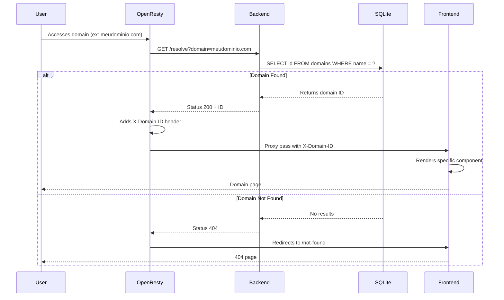

# White Label Domain Mapping

This project demonstrates how to implement a white label system controlled via OpenResty, where request flow is intelligently managed to serve different visual identities based on the domain.

## System Flow



## Overview

The system uses a layered architecture:
- OpenResty as reverse proxy and main flow controller
- Node.js backend that validates and identifies domains
- SvelteKit frontend that renders content based on the identified domain

## How It Works

1. User accesses a specific domain (ex: `meudominio.com`)
2. OpenResty intercepts the request and forwards it to the backend
3. Backend verifies if the domain exists:
   - If it exists: returns status 200 with the domain ID
   - If it doesn't exist: returns status 404
4. OpenResty then:
   - On success (200): proxy passes to frontend with `X-Domain-ID` header
   - On error (404): redirects to the not-found page of the searched domain
5. Frontend, upon receiving the `X-Domain-ID` header, renders the specific content for that domain

## About the Project

This is a demonstrative project that aims to show a simple and straightforward implementation of a white label system. The current architecture is intentionally basic to facilitate understanding of the concept, but there are several opportunities for refinement:

- Cache implementation for better performance
- More robust template system
- Domain-specific asset management
- More elaborate configuration system
- Domain-specific authentication and authorization
- Domain-specific analytics and metrics

## Use Cases

White label systems are commonly used in:

1. **SaaS (Software as a Service)**
   - A company sells its software to other companies, who offer it under their own brand
   - Example: An e-commerce platform that can be customized for different retailers

2. **Marketplaces**
   - Platforms that allow sellers to have their own virtual stores
   - Example: An online course platform where each teacher has their own "school"

3. **Financial Services**
   - Banks and fintechs that offer services to other institutions
   - Example: A payment platform that can be integrated with different banks

4. **Education**
   - Learning platforms that can be customized for different institutions
   - Example: An LMS (Learning Management System) used by different universities

5. **Marketing Services**
   - Marketing tools that can be offered by different agencies
   - Example: A marketing automation platform customized for each agency

## How to Test

### Prerequisites
- Docker and Docker Compose installed
- Administrator access to modify the `/etc/hosts` file

### Setup

1. **Configure Local Domains**
   Add the following domains to your `/etc/hosts` file:
   ```bash
   127.0.0.1 meudominio.com
   127.0.0.1 whitelabel.com
   127.0.0.1 tiopatinhas.com
   127.0.0.1 naoexiste.com
   ```

2. **Start Services**
   ```bash
   docker-compose up
   ```
   This will start:
   - OpenResty on port 8080
   - Backend on port 3000
   - Frontend on port 5173

   > **Note about Ports**: Although SvelteKit runs on port 5173, all traffic is managed by OpenResty on port 8080. OpenResty acts as a reverse proxy, receiving all requests and forwarding them internally to the appropriate service. This is necessary because OpenResty needs to intercept all requests to verify the domain before deciding where to forward the traffic.

### Testing Scenarios

1. **Valid Domains**
   Access in your browser:
   - `http://meudominio.com:8080`
   - `http://whitelabel.com:8080`
   - `http://tiopatinhas.com:8080`
   
   Each should show its specific content.

2. **Unregistered Domain**
   Access:
   - `http://naoexiste.com:8080`
   
   You will be redirected to the not-found page.

### Database Structure

The system uses SQLite with the following structure:
```sql
CREATE TABLE domains (
  id TEXT PRIMARY KEY,
  name TEXT NOT NULL,
  created_at TEXT NOT NULL
);
```

Sample data:
```sql
INSERT INTO domains(id, name, created_at) VALUES(1, 'meudominio.com', '2021-01-01');
INSERT INTO domains(id, name, created_at) VALUES(2, 'whitelabel.com', '2021-01-01');
INSERT INTO domains(id, name, created_at) VALUES(3, 'tiopatinhas.com', '2021-01-01');
```

### Rendering Examples

[whitelabel.com](http://whitelabel.com:8080)


[meudominio.com](http://meudominio.com:8080)


[naoexiste.com](http://naoexiste.com:8080)


### Troubleshooting

1. **If domains are not working:**
   - Verify that `/etc/hosts` was updated correctly
   - Ensure there are no port 8080 conflicts
   - Check container logs: `docker-compose logs openresty`

2. **If database is not populated:**
   - Verify that `domains.db` file was created
   - Run the SQL insert commands again

3. **If frontend is not responding:**
   - Check if container is running: `docker-compose ps`
   - Check logs: `docker-compose logs frontend`

## Project Structure

```
.
├── frontend/          # SvelteKit application
├── backend/          # Node.js API
└── openresty/        # OpenResty configurations
```

## Technologies Used

- Frontend: SvelteKit
- Backend: Node.js + Express
- Proxy: OpenResty
- Database: SQLite 