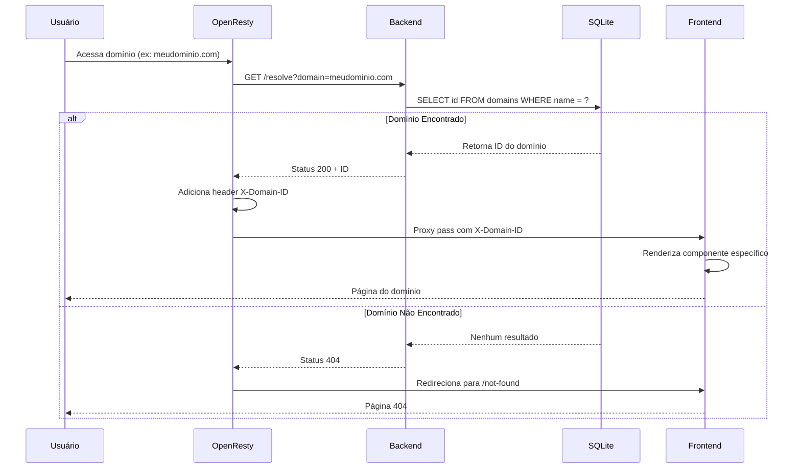

# White Label Domain Mapping

Este projeto demonstra como implementar um sistema white label controlado via OpenResty, onde o fluxo de requisições é gerenciado de forma inteligente para servir diferentes identidades visuais baseadas no domínio.

## Fluxo do Sistema



## Visão Geral

O sistema utiliza uma arquitetura em camadas:
- OpenResty como proxy reverso e controlador principal do fluxo
- Backend em Node.js que valida e identifica os domínios
- Frontend em SvelteKit que renderiza o conteúdo baseado no domínio identificado

## Como Funciona

1. O usuário acessa um domínio específico (ex: `meudominio.com`)
2. O OpenResty intercepta a requisição e a encaminha para o backend
3. O backend verifica se o domínio existe:
   - Se existir: retorna status 200 com o ID do domínio
   - Se não existir: retorna status 404
4. O OpenResty então:
   - Em caso de sucesso (200): faz proxy pass para o frontend com o header `X-Domain-ID`
   - Em caso de erro (404): redireciona para a página not-found do domínio procurado
5. O frontend, ao receber o header `X-Domain-ID`, renderiza o conteúdo específico daquele domínio

## Sobre o Projeto

Este é um projeto demonstrativo que visa mostrar uma implementação simples e direta de um sistema white label. A arquitetura atual é intencionalmente básica para facilitar o entendimento do conceito, mas existem várias oportunidades de refinamento:

- Implementação de cache para melhor performance
- Sistema de templates mais robusto
- Gerenciamento de assets por domínio
- Sistema de configuração mais elaborado
- Autenticação e autorização por domínio
- Analytics e métricas específicas por domínio

## Casos de Uso

Sistemas white label são comumente utilizados em:

1. **SaaS (Software as a Service)**
   - Uma empresa vende seu software para outras empresas, que o oferecem com sua própria marca
   - Exemplo: Uma plataforma de e-commerce que pode ser personalizada para diferentes varejistas

2. **Marketplaces**
   - Plataformas que permitem que vendedores tenham suas próprias lojas virtuais
   - Exemplo: Uma plataforma de cursos online onde cada professor tem sua própria "escola"

3. **Serviços Financeiros**
   - Bancos e fintechs que oferecem serviços para outras instituições
   - Exemplo: Uma plataforma de pagamentos que pode ser integrada com diferentes bancos

4. **Educação**
   - Plataformas de ensino que podem ser personalizadas para diferentes instituições
   - Exemplo: Um LMS (Learning Management System) usado por diferentes universidades

5. **Serviços de Marketing**
   - Ferramentas de marketing que podem ser oferecidas por diferentes agências
   - Exemplo: Uma plataforma de automação de marketing personalizada para cada agência

## Estrutura do Projeto

```
.
├── frontend/          # Aplicação SvelteKit
├── backend/          # API Node.js
└── openresty/        # Configurações do OpenResty
```

## Tecnologias Utilizadas

- Frontend: SvelteKit
- Backend: Node.js + Express
- Proxy: OpenResty
- Banco de Dados: SQLite

## Como Testar

### Pré-requisitos
- Docker e Docker Compose instalados
- Acesso de administrador para modificar o arquivo `/etc/hosts`

### Configuração

1. **Configurar Domínios Locais**
   Adicione os seguintes domínios ao seu arquivo `/etc/hosts`:
   ```bash
   127.0.0.1 meudominio.com
   127.0.0.1 whitelabel.com
   127.0.0.1 tiopatinhas.com
   127.0.0.1 naoexiste.com
   ```

2. **Iniciar os Serviços**
   ```bash
   docker-compose up
   ```
   Isso iniciará:
   - OpenResty na porta 8080
   - Backend na porta 3000
   - Frontend na porta 5173

   > **Nota sobre as Portas**: Embora o SvelteKit rode na porta 5173, todo o tráfego é gerenciado pelo OpenResty na porta 8080. O OpenResty atua como um proxy reverso, recebendo todas as requisições e encaminhando-as internamente para o serviço apropriado. Isso é necessário porque o OpenResty precisa interceptar todas as requisições para verificar o domínio antes de decidir para onde encaminhar o tráfego.

### Testando os Cenários

1. **Domínios Válidos**
   Acesse no navegador:
   - `http://meudominio.com:8080`
   - `http://whitelabel.com:8080`
   - `http://tiopatinhas.com:8080`
   
   Cada um deve mostrar seu conteúdo específico.

2. **Domínio Não Registrado**
   Acesse:
   - `http://naoexiste.com:8080`
   
   Você será redirecionado para a página not-found.

### Estrutura do Banco de Dados

O sistema usa SQLite com a seguinte estrutura:
```sql
CREATE TABLE domains (
  id TEXT PRIMARY KEY,
  name TEXT NOT NULL,
  created_at TEXT NOT NULL
);
```

Dados de exemplo:
```sql
INSERT INTO domains(id, name, created_at) VALUES(1, 'meudominio.com', '2021-01-01');
INSERT INTO domains(id, name, created_at) VALUES(2, 'whitelabel.com', '2021-01-01');
INSERT INTO domains(id, name, created_at) VALUES(3, 'tiopatinhas.com', '2021-01-01');
```

### Exemplos de renderizações

[whitelabel.com](http://whitelabel.com:8080)


[meudominio.com](http://meudominio.com:8080)


[naoexiste.com](http://naoexiste.com:8080)


### Troubleshooting

1. **Se os domínios não estiverem funcionando:**
   - Verifique se o `/etc/hosts` foi atualizado corretamente
   - Certifique-se de que não há conflitos de porta 8080
   - Verifique os logs do container: `docker-compose logs openresty`

2. **Se o banco de dados não estiver populado:**
   - Verifique se o arquivo `domains.db` foi criado
   - Execute os comandos SQL de inserção novamente

3. **Se o frontend não estiver respondendo:**
   - Verifique se o container está rodando: `docker-compose ps`
   - Verifique os logs: `docker-compose logs frontend`

